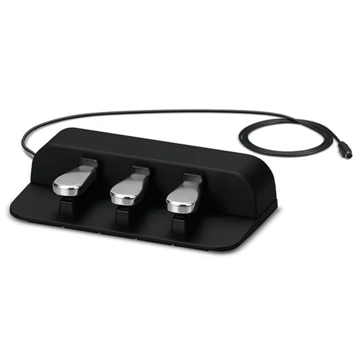

# iPedal

# Introduction

[https://github.com/vietphan1995/i-pedal.git](https://github.com/vietphan1995/i-pedal.git)

iPedal is a digital hardware like digital mouse pad that strongly helps you transmit input signal from people to computer by your foot.

iPedal can be a pad with simple navigation arrows, this pad has size same with existing foot device like music pedal, car accelerator, …

iPedal shape can be liked music pedal, car accelerator, button, … with correspond experience goes with hub for navigate function definition.

iPedal improves people activity in busy hands but need to exchange supported screen views, contents. This activity can be listed as music playing, representing, livestreaming, driving experience, disabled people function … iPedal improves performance, quality life through these activities.

[back to projects …](https://github.com/vietphan1995/projects)

### Notes
https://phantrungviet.notion.site/iPedal-1b25e832d6ee8019b6f3fdcc10c1d987